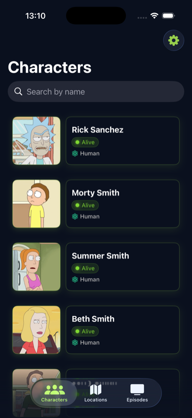
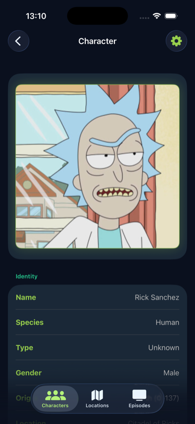
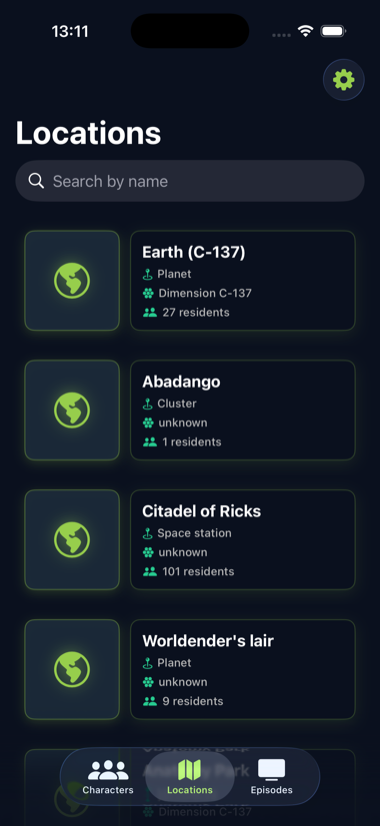
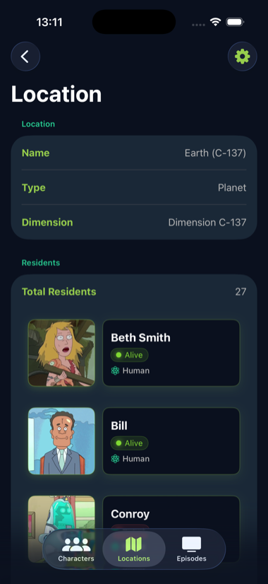
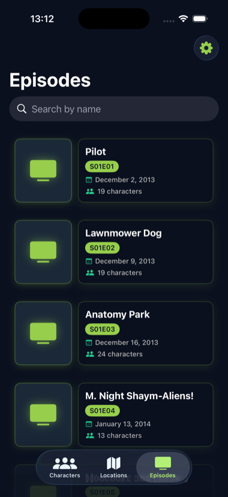
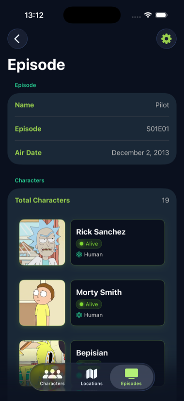
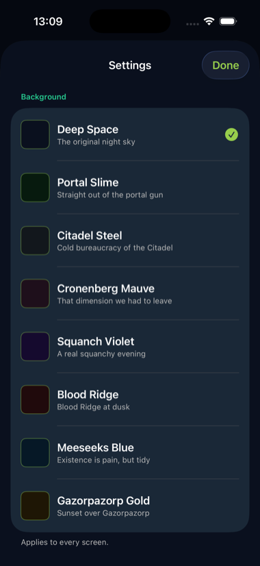
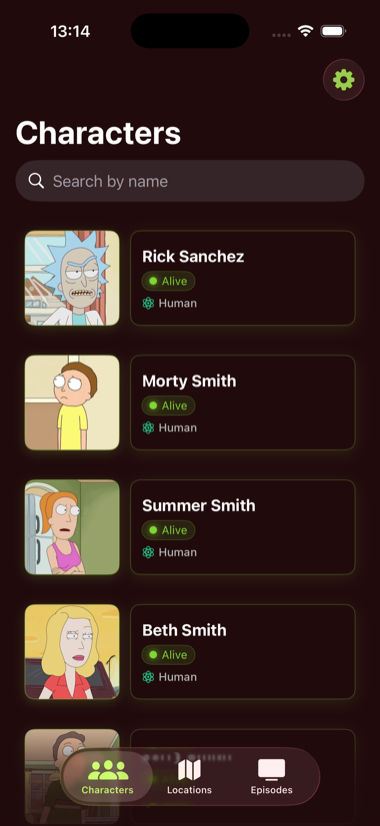

# Rick and Morty Characters

A native iOS app built with SwiftUI that browses the characters, locations and episodes of the [Rick and Morty API](https://rickandmortyapi.com), with no third-party dependencies.

## Screenshots

Using default theme:

| List | Details |
| --- | --- |
|  |  |
|  |  |
|  |  |

The background is a user preference. Any of eight can be picked from the gear button, and it applies to every screen:

| Theme selector | New theme selected |
| --- | --- |
|  |  |

## What it does

The app opens on a tab bar with three sections.

**Characters** — a paginated list with pull-to-refresh. Search filters by name with a 250 ms debounce, and a scope bar filters by status (All, Alive, Dead, Unknown). Selecting a character opens a detail view showing its image, status, species, gender, origin, last known location and episode count.

**Locations** — a paginated, searchable list of locations. The detail view lists the residents of each one.

**Episodes** — a paginated, searchable list of episodes. The detail view resolves the episode's character URLs and shows everyone who appears in it.

The interface uses a custom dark palette defined in `GalacticTheme` — portal green, teal and purple accents over a background the viewer chooses. `GalacticBackground` defines eight, all dark, and the choice is stored in `UserDefaults` and applied across every screen.

Missing or empty API fields render as "Unknown" rather than blank space.

## Requirements

- Xcode with the iOS 17.6 SDK or later
- Swift 5
- Builds for iPhone and iPad

No package manager steps. The project uses only Foundation, SwiftUI and Combine.

## Build and run

1. Open `Rick and Morty Characters.xcodeproj`
2. Choose an iOS simulator
3. Run

## Architecture

MVVM. Each screen has a `View` and an `ObservableObject` view model that publishes state through `@Published`.

Networking sits behind a `Service` protocol implemented by `ApiService`, which wraps `URLSession` and uses async/await. `URLSession` is injected through the initialiser, so tests substitute a mock without touching call sites. Errors surface as typed `NetworkingError` values.

```
Rick and Morty Characters/
├── App/          # App entry point
├── Model/        # API response types, domain models, enums, extensions
├── Networking/   # Service protocol, ApiService, NetworkingError
├── View/         # SwiftUI screens, MainTabView, GalacticTheme
└── ViewModel/    # ObservableObject state per screen
```

## Tests

`Rick and Morty CharactersTests` covers the service layer and view models. `MockURLProtocol` intercepts requests so response parsing and error paths are tested without network access. Tests are annotated `@MainActor`.

`Rick and Morty CharactersUITests` holds the XCUITest target with launch tests in place.

## Known gaps

- iPad runs the iPhone layout; no `NavigationSplitView` adaptation
- Layouts are not tuned for landscape
- Light appearance is not supported — the palette assumes dark
- UI test coverage is scaffolding rather than real workflow tests
